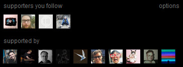

## Bandcamp

### [Bandcamp Album Tags On Collection Pages](bandcamp_collection_tags/)

Shows album tags when hovering over an album on a collection page

#### [Source](bandcamp_collection_tags/bandcamp_collection_tags.user.js) | [Install](https://github.com/squeek502/userscripts/raw/master/bandcamp_collection_tags/bandcamp_collection_tags.user.js) | [Greasyfork.org](https://greasyfork.org/en/scripts/391460-bandcamp-album-tags-on-collection-pages) | [OpenUserJS.org](https://openuserjs.org/scripts/squeek502/Bandcamp_Album_Tags_On_Collection_Pages)

---

### [Bandcamp Collection Filters](bandcamp_collection_filters/)

Retrieves a list of all items in a collection or wishlist that matches one of the following filters:

- `free`: Any items that are either free or "name your price" (with no minimum)
- `purchased`: Any items that you have purchased
- `wishlisted`: Any items that you have wishlisted

#### [Source](bandcamp_collection_filters/bandcamp_collection_filters.user.js) | [Install](https://github.com/squeek502/userscripts/raw/master/bandcamp_collection_filters/bandcamp_collection_filters.user.js) | [Greasyfork.org](https://greasyfork.org/en/scripts/391461-bandcamp-collection-filters) | [OpenUserJS.org](https://openuserjs.org/scripts/squeek502/Bandcamp_Collection_Filters)

---

### [Bandcamp Supporters You Follow](bandcamp_followed_supporters/)

Shows supporters of an album/track that you follow.

Options:

#### [Source](bandcamp_followed_supporters/bandcamp_followed_supporters.user.js) | [Install](https://github.com/squeek502/userscripts/raw/master/bandcamp_followed_supporters/bandcamp_followed_supporters.user.js)
